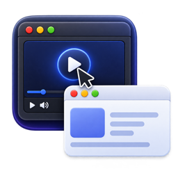
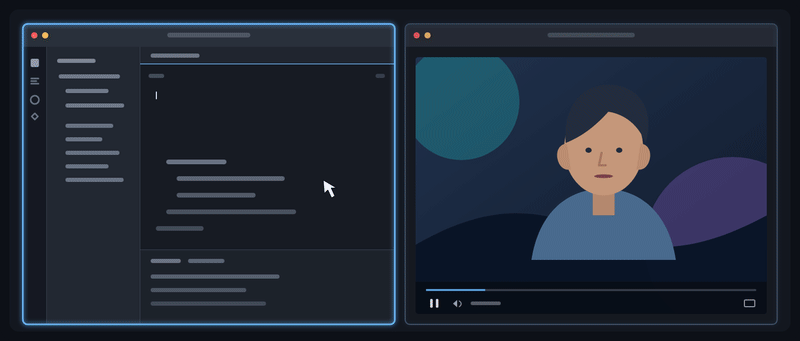

<p align="center">
  
</p>

<h1 align="center">jfc</h1>

You have a wide screen or two displays, and you're working with two windows: one
for coding, the other for a media player—say, YouTube. You want to quickly play
or pause a video, or navigate to another one, but macOS swallows your first
click just to activate the media window, forcing you to click again. It gets a
little annoying every time. Well, no more!

JFC is a minimal app that makes your first click go through.

[Download the latest release](https://github.com/engina/jfc/releases/latest) · macOS 14+

<p align="center">
  
</p>

## How it works

On a left mouse-down over inactive app content, JFC:

1. Resolves the target window with macOS Accessibility.
2. Focuses the window and activates its application.
3. Returns the original physical `CGEvent` unchanged.

There is no synthesized click, event reposting, or focus-follows-mouse. Clicks
in the active app pass through normally, and failures fail open. JFC observes
no keyboard input and requires Accessibility permission only.

## Build

```sh
scripts/build-app.sh
open .build/JFC.app
```

Closing the window leaves JFC running. Reopen the app to show its controls;
press `Cmd-Q` to quit.
