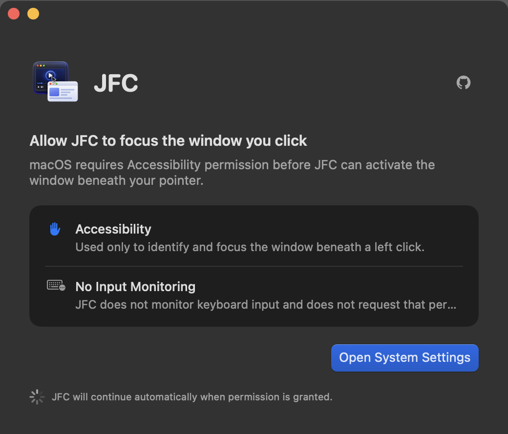
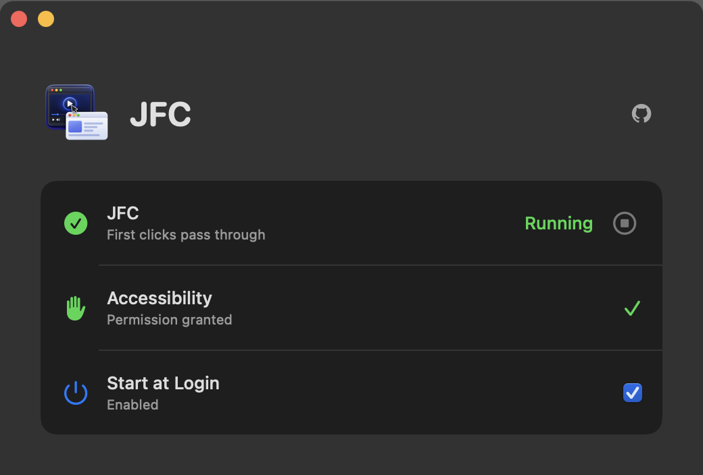
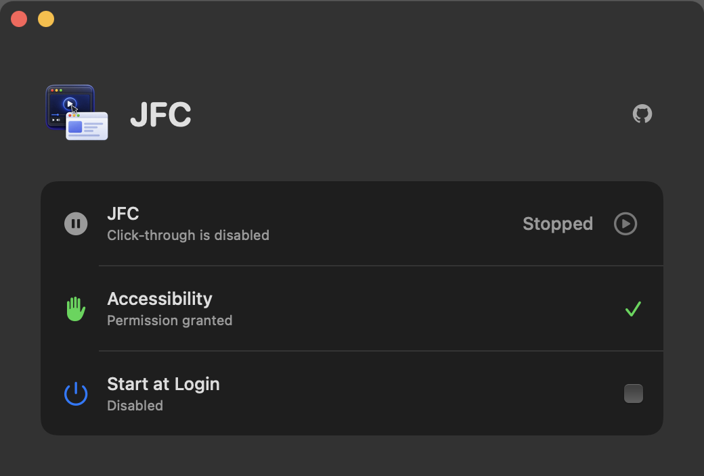

<p align="center">
  
</p>

<h1 align="center">jfc</h1>

You have a wide screen or two displays, and you're working with two windows: one
for coding, the other for a media player—say, YouTube. You want to quickly play
or pause a video, or navigate to another one, but macOS swallows your first
click just to activate the media window, forcing you to click again. It gets a
little annoying every time. Well, no more!

JFC is a minimal app that makes your first click go through.

[Download the latest release](https://github.com/engina/jfc/releases/latest) · macOS 14+

<p align="center">
  
</p>

## Screenshots







## How it works

On a left mouse-down over inactive app or window content, JFC:

1. Resolves the target window with macOS Accessibility.
2. Focuses the window and, when needed, activates its application.
3. Returns the original physical `CGEvent` unchanged.

There is no synthesized click, event reposting, or focus-follows-mouse. Clicks
in the already-focused window pass through normally, and failures fail open.
JFC observes no keyboard input and requires Accessibility permission only.

## Build

For a frictionless experience, use the signed binaries from the latest release.

```sh
scripts/build-app.sh
open .build/JFC.app
```

Closing the window leaves JFC running. Reopen the app to show its controls;
press `Cmd-Q` to quit.

## Input diagnostic

The separate `jfc-input-diagnostic` executable records a left click at the
public HID and Core Graphics layers for physical-versus-automated input
comparison. It observes no keyboard events and does not change JFC's runtime
permissions or event path. See [RESEARCH.md](RESEARCH.md) for usage and output
details. The reproducible UTM, multi-display, Appium, and virtual-HID test setup
is maintained in [E2E_RUNBOOK.md](E2E_RUNBOOK.md).

For focus failures, the preserved CLI also has an explicit forensic mode:

```sh
.build/debug/jfc --verbose --trace-jsonl /tmp/jfc-focus.jsonl
```

This records the original left-click event, every activation operation and its
timing, WindowServer ordering checkpoints, delayed AX state, and display
topology. It is never enabled by the menu-bar app and does not change JFC's
Accessibility-only permission model. The file contains private application,
window, control, cursor, and raw-event metadata; do not publish it without
reviewing it. The extra observation work can also perturb timing, so it is a
diagnostic capture rather than a normal operating mode.
